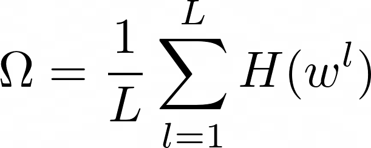
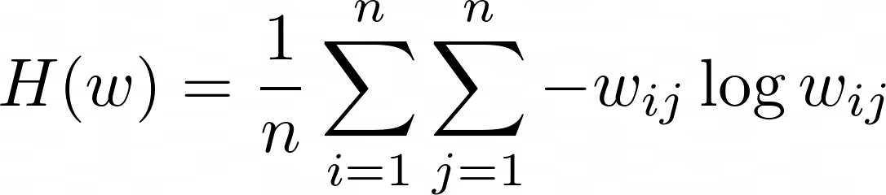
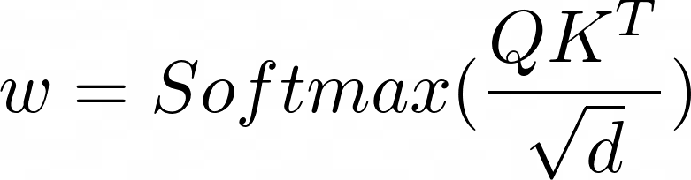
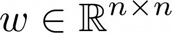

# Attention Entropy

Experimenting with a novel Regularization "Attention Entropy" to help make transformers data efficient.

## TLDR
Force tokens to only attend to few other tokens i.e. low entropy in attention weights. 
This restriction is lifted after few hundred batches of training.

### Formulation

The `Attention Entropy` penalty is defined as:
<p style="text-align: center;">

<br>

</p>

Attention Weights for a layer is defined as:
<p style="text-align: center;">

</p>
Where,
<p style="text-align: center;">

</p>

### PyTorch Implementation

In [Line 43](models/vit.py), 
```python
def attention_entropy(attention):
    attention = attention + 1e-8 # to avoid getting NaNs (log0 = nan)
    return (-attention * torch.log(attention)).sum(-1).mean()
```

## Usage
### CIFAR10
- Train ViT with Attention Entropy
```python
python3 train_cifar10.py --net vit --use_attention_entropy 1
```
- Train ViT without Attention Entropy
```python
python3 train_cifar10.py --net vit --use_attention_entropy 0
```

## Experiments
```
Coming Soon!
```
